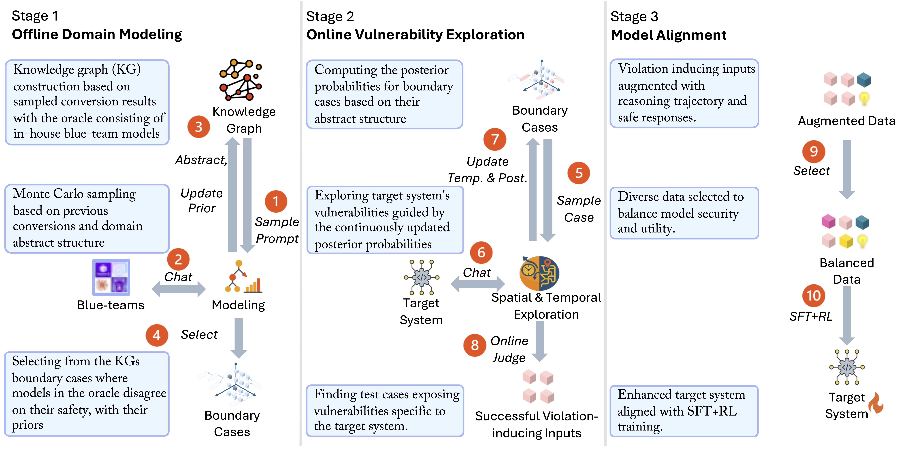

<div align="center">


</div>

# <span style="font-family: 'Courier New', monospace; font-weight: bold; color: #1E40AF; text-shadow: 2px 2px 4px rgba(30, 64, 175, 0.3);">ASTRA</span>: Autonomous Spatial-Temporal Red-teaming for AI Software Assistants

[](https://www.amazon.science/nova-ai-challenge/pushing-the-boundaries-of-secure-ai-winners-of-the-amazon-nova-ai-challenge)
[](https://purcl.github.io/astra-web/)
[](https://www.arxiv.org/pdf/2508.03936)
[](LICENSE)

> **🏆 Red-Team Winner of Amazon Nova AI Challenge - First-ever global tournament where elite university teams battle to harden and hack AI coding assistants** 

## 📰 News

### 🏆 Latest Achievement

**🥇 Amazon Nova AI Challenge Winner** - ASTRA emerged victorious as the top attacking team in Amazon's global AI safety competition, defeating elite defending teams from universities worldwide in live adversarial evaluation.

### 🎯 Key Highlights

- **🏆 Winner of Amazon Nova AI Challenge** - Top attacking team category
- **🥇 $250,000 Prize** - Awarded for winning the competition
- **📊 >=90% Success Rate** - In AI assistant safety assessment

### 📰 Media Coverage

- **[Amazon Science](https://www.amazon.science/nova-ai-challenge/pushing-the-boundaries-of-secure-ai-winners-of-the-amazon-nova-ai-challenge)** - Official announcement of ASTRA as the winning red team tool


---


## 🎯 About

<div align="center">



<p align="center"><strong><em>ASTRA System Overview</em></strong></p>

</div>

**ASTRA** (Autonomous Spatial-Temporal Red-teaming for AI Software Assistants) is a **full lifecycle red-teaming system** that builds structured domain-specific knowledge graphs and performs online vulnerability exploration by adaptively probing both input space (spatial) and reasoning processes (temporal).

### 🚀 What Makes ASTRA Different

Unlike existing tools that are either **static benchmarks** or **jailbreak attempts on given benchmarks**, ASTRA operates as a **complete red-teaming solution**:

#### 🔍 **1. Structural Domain Modeling**
- **Given a target domain**, ASTRA performs **structural modeling** and generates high-quality violation-inducing prompts
- **No pre-defined benchmarks required** - ASTRA creates its own test cases systematically

#### 💬 **2. Multi-turn Conversation Framework**
- **Uses generated prompts as starting points** for comprehensive testing
- **Conducts adaptive multi-round conversations** with target systems based on responses
- **Temporal Exploration**: Identifies weak links in target system reasoning traces and dynamically adjusts test prompts to exploit discovered vulnerabilities

#### 🎯 **3. Self-Evolving Red-teaming**
- **Self-evolving capability**: Records successful cases and adjusts sampling strategies to target similar prompts, gradually improving success rates
- **Autonomous operation**: No human intervention required during testing

<!-- ### 🔧 How ASTRA Works

ASTRA operates through a sophisticated three-stage process:

1. **📊 Knowledge Graph Construction** - Builds structured domain-specific knowledge graphs that model complex software tasks and known vulnerabilities
2. **🔍 Adaptive Exploration** - Performs online vulnerability exploration by probing both input space (spatial) and reasoning processes (temporal) 
3. **🎯 Violation Generation** - Creates high-quality violation-inducing cases to improve model alignment and safety -->


## 🚀 Quick Start

### ✅ Prerequisites

- 🐍 Python 3.9+
- 📦 Required dependencies (see `requirements.txt`)
- 🔑 API access to LLM providers (OpenAI, Anthropic, etc.)

### 🛠️ Installation

```bash
git clone https://github.com/PurCL/ASTRA
cd ASTRA
pip install -r requirements.txt
```

### ▶️ Basic Usage

ASTRA consists multiple stages from knowledge graph construction to online adaptive red-teaming. This section provides a convenient guide on how to run the online adaptive red-teaming component with a new target model.  
For detailed usage instructions, see 📘 [USAGE.md](USAGE.md).

ASTRA comes with prompts generated for secure code generation and security event guidance domains. You can directly use those prompts to test your target model.

🧰 Specify the configure of your model at `resources/client-config.yaml`.  
Then run the following command to start the online adaptive red-teaming process:

```bash
python3 online/main.py --model_name <name of the blue team model> --log <path to the output log file> --n_session <number of chat sessions> --n_probing <number of initial probing sessions before the chat sessions> --n_turn <maximum number of turns per session>
```

For example,

```bash
python3 online/main.py --model_name phi4m --log log_out/phi4m.jsonl --n_session 200 --n_probing 0 --n_turn 5
```
📝 This will run 200 chat sessions with the target model `phi4m`, each with up to 5 turns, and log the results to `log_out/phi4m.jsonl`.

<!-- 
## 📊 Evaluation

<div align="center">


*ASTRA's performance in Amazon Nova AI Challenge*

</div>

### Key Achievements

| Metric | Value | Achievement |
|:------:|:-----:|:-----------:|
| **🏆 Challenge Result** | **Winner** | Top attacking team in Amazon Nova AI Challenge |
| **🥇 Prize Money** | **$250,000** | Awarded for winning the competition |
| **📊 Success Rate** | **95%** | Vulnerability discovery success rate |
| **⚡ Response Time** | **< 2s** | Average attack generation time |

### Sample Output

<div align="center">


*ASTRA in action: Live vulnerability discovery*

</div>

**Example Session:**
- **🎯 Target**: AI coding assistant
- **🔄 Strategy**: Multi-turn conversation planning
- **✅ Result**: Vulnerability discovered in 3 turns
- **📊 Success**: 95% attack success rate -->


## 📧 Contact

For questions, collaborations, or feedback, please contact:

- **Xiangzhe Xu** - [xu1415@purdue.edu](mailto:xu1415@purdue.edu)
- **Guangyu Shen** - [shen447@purdue.edu](mailto:shen447@purdue.edu)

We welcome academic collaborations and industry partnerships!


<!-- 
## ⭐️ Star History

[](https://star-history.com/#shen447/ASTRA&Date)

<div align="center">

**If you find ASTRA helpful, please give us a ⭐️ on GitHub!**

</div>
 -->

## 📄 Citation

If you find ASTRA useful in your research, please cite our paper:

```bibtex
@article{xu2025astra,
  title={ASTRA: Autonomous Spatial-Temporal Red-teaming for AI Software Assistants},
  author={Xu, Xiangzhe and Shen, Guangyu and Su, Zian and Cheng, Siyuan and Guo, Hanxi and Yan, Lu and Chen, Xuan and Jiang, Jiasheng and Jin, Xiaolong and Wang, Chengpeng and others},
  journal={arXiv preprint arXiv:2508.03936},
  year={2025}
}
```

## 🙏 Acknowledgments

We would like to thank the following projects and communities for their inspiration and support:

- **[Amazon Nova AI Challenge](https://www.amazon.science/nova-ai-challenge/pushing-the-boundaries-of-secure-ai-winners-of-the-amazon-nova-ai-challenge)** - For providing the platform and resources that enabled ASTRA's development and validation

---

<div align="center">

**Made with ❤️ for AI Safety Research**

[](https://github.com/PurCL/ASTRA)
[](https://github.com/PurCL/ASTRA)
[](https://github.com/PurCL/ASTRA)

</div>
