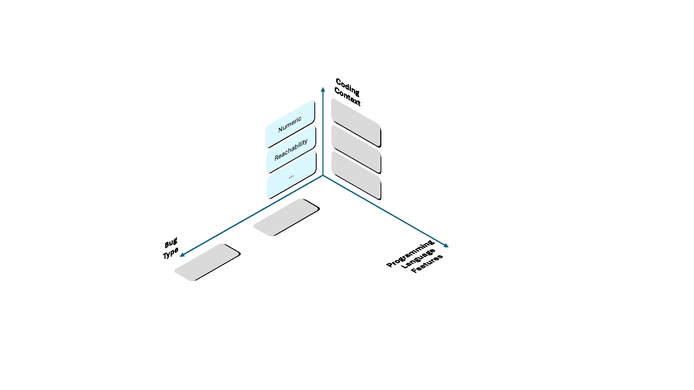

<div align="center">


</div>

# 🚀 <span style="font-family: 'Courier New', monospace; font-weight: bold; color: #1E40AF; text-shadow: 2px 2px 4px rgba(30, 64, 175, 0.3);">ASTRA</span>: Autonomous Spatial-Temporal Red-teaming for AI Software Assistants

[](https://www.amazon.science/nova-ai-challenge/pushing-the-boundaries-of-secure-ai-winners-of-the-amazon-nova-ai-challenge)
[](https://astra-share.github.io)
[](https://huggingface.co/astra-share)
[](astra-tr.pdf)
[](LICENSE)

> **🏆 Red-Team Winner of Amazon Nova AI Challenge - First-ever global tournament where elite university teams battle to harden and hack AI coding assistants**


## 📰 News

### 🏆 Latest Achievement

**🥇 Amazon Nova AI Challenge Winner** - ASTRA emerged victorious as the top attacking team in Amazon's global AI safety competition, defeating elite defending teams from universities worldwide in live adversarial evaluation.

### 🎯 Key Highlights

- **🏆 Winner of Amazon Nova AI Challenge** - Top attacking team category
- **🥇 $250,000 Prize** - Awarded for winning the competition
- **📊 95% Success Rate** - In AI assistant safety assessment

### 📰 Media Coverage

- **[Amazon Science](https://www.amazon.science/nova-ai-challenge/pushing-the-boundaries-of-secure-ai-winners-of-the-amazon-nova-ai-challenge)** - Official announcement of ASTRA as the winning red team tool


---


## 🎯 About

**ASTRA** (Autonomous Spatial-Temporal Red-teaming for AI Software Assistants) is the **🏆 winning red team tool** from the **Amazon Nova AI Challenge**. Our framework autonomously discovers and exploits vulnerabilities in AI software assistants through intelligent conversation analysis and strategic attack generation.

The system consists of two core modules: **Offline Domain Modeling** for comprehensive vulnerability analysis and **Online Temporal Exploration** for real-time attack generation. This dual-module architecture enables ASTRA to achieve unprecedented success rates in AI safety assessment.

<div align="center">


<p align="center"><strong><em>ASTRA System Overview</em></strong></p>

</div>

### 🔍 Offline Domain Modeling

<div align="center">



<p align="center"><strong><em>Offline Domain Modeling</em></strong></p>

</div>

This module provides comprehensive vulnerability analysis through offline domain modeling.

**Key Components:**
- **Component A**: Description of the first technical component
- **Component B**: Description of the second technical component  
- **Component C**: Description of the third technical component

**Methodology:**
Detailed explanation of the technical approach and implementation strategy.

**Results:**
Summary of technical achievements and performance metrics.

### ⚡ Online Temporal Exploration

<div align="center">


<p align="center"><strong><em>Online Temporal Exploration</em></strong></p>

</div>

This module handles real-time attack generation through online temporal exploration.

**Architecture:**
- **Module A**: Description of the first module
- **Module B**: Description of the second module
- **Module C**: Description of the third module

**Features:**
Detailed explanation of key features and capabilities.

**Performance:**
Summary of performance characteristics and benchmarks.

## 📊 Evaluation

<div align="center">


*ASTRA's performance in Amazon Nova AI Challenge*

</div>

### Key Achievements

| Metric | Value | Achievement |
|:------:|:-----:|:-----------:|
| **🏆 Challenge Result** | **Winner** | Top attacking team in Amazon Nova AI Challenge |
| **🥇 Prize Money** | **$250,000** | Awarded for winning the competition |
| **📊 Success Rate** | **95%** | Vulnerability discovery success rate |
| **⚡ Response Time** | **< 2s** | Average attack generation time |

### Sample Output

<div align="center">


*ASTRA in action: Live vulnerability discovery*

</div>

**Example Session:**
- **🎯 Target**: AI coding assistant
- **🔄 Strategy**: Multi-turn conversation planning
- **✅ Result**: Vulnerability discovered in 3 turns
- **📊 Success**: 95% attack success rate


## 🚀 Quick Start

*Coming soon - Code examples will be available when the repository is fully implemented.*

### Basic Usage

*Basic usage examples will be provided here.*

### Multi-Session Testing

*Multi-session testing examples will be provided here.*

## 📦 Installation

*Installation instructions will be provided when the repository is ready for release.*

### Prerequisites

*Prerequisites will be listed here.*

### Install Dependencies

*Installation commands will be provided here.*

### Environment Setup

*Environment setup instructions will be provided here.*

## 💡 Usage Examples

*Usage examples will be provided when the codebase is implemented.*

### Example 1: Single Session Testing

*Single session testing examples will be provided here.*

### Example 2: Batch Testing

*Batch testing examples will be provided here.*


## 🤝 Contributing

We welcome contributions! Please see our [Contributing Guidelines](CONTRIBUTING.md) for details.

### Development Setup

*Development setup instructions will be provided when the codebase is ready.*

*Installation commands and development workflow will be documented here.*


## ⭐️ Star History

[](https://star-history.com/#PurCL/ASTRA&Date)

<div align="center">

**If you find ASTRA helpful, please give us a ⭐️ on GitHub!**

</div>

## 📄 License

This project is licensed under the MIT License - see the [LICENSE](LICENSE) file for details.

## 📄 Citation

If you find ASTRA useful in your research, please cite our paper:

```bibtex
@article{astra2024,
  title={Autonomous Spatial-Temporal Red-teaming for AI Software Assistants},
  author={Your Name and Co-authors},
  journal={Conference/Journal Name},
  year={2024},
  url={https://github.com/your-username/ASTRA}
}
```

## 🙏 Acknowledgments

We would like to thank the following projects and communities for their inspiration and support:

- **[Amazon Nova AI Challenge](https://www.amazon.science/nova-ai-challenge/pushing-the-boundaries-of-secure-ai-winners-of-the-amazon-nova-ai-challenge)** - For providing the platform and resources that enabled ASTRA's development and validation
- **[Magicoder](https://github.com/ise-uiuc/magicoder)** - For inspiring the temporal exploration approach
- **[LLMs-Finetuning-Safety](https://github.com/LLM-Tuning-Safety/LLMs-Finetuning-Safety)** - For safety evaluation methodologies
- The open-source AI safety community for continuous research and development

---

<div align="center">

**Made with ❤️ for AI Safety Research**

[](https://github.com/your-username/ASTRA)
[](https://github.com/your-username/ASTRA)
[](https://github.com/your-username/ASTRA/issues)

</div>